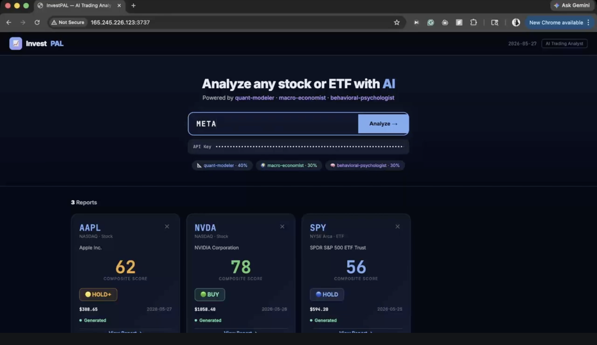

# InvestPAL: AI Trading Analyst
investPAL is an multi-agent investment tool that automates professional analysis workflow.
While standard human analysis forces repetitive manual work; and existing AI tools lack backtesting validation, and generates analysis too complex for everyday users to interpret effectively, investPAL orchestrates specialized quant-modeler, macro-economist, and behavioral-psychologist AI subagents in parallel to replicate institutional evaluation protocols, utilizes a dedicated historical backtesting engine to build measurable strategy confidence, and offers a dual user experience where a visual Web UI charts complex numeric data while an interactive CLI allows non-professionals to easily interpret long reports through natural-language chat.

Try at http://165.245.226.123:3737/, latest code on branch feature/frontend

## Features

This project supports two complementary user experiences — a readability-focused web UI for single-stock snapshots, and a full-featured CLI for interactive, production-style analysis (including backtests and portfolio runs).

- **Web UI (single-stock current analysis)**
  - Focused on clarity and readability: generated reports are parsed and rendered with clear sections (Quick Snapshot, Technicals, Fundamentals, Scenarios, Portfolio Impact, Token Usage).
  - Markdown reports include numeric summaries and support visualizations (tables, inline charts/images when available) to make figures easy to scan.
  - The UI currently supports analysis of a single stock at a time (current snapshot). It displays an easy-to-read parsed report and exposes a downloadable backtest `.md` when available.
  - Designed for quick drill-down and comparison; reports are saved to `output/` so they can be re-opened or downloaded.

- **Native CLI (terminal) — full workflow & interactivity**
  - Supports both current snapshots and historical backtests for a single stock (`/investpal quick-portfolio` and `/investpal backtest`).
  - Supports portfolio analyses: provide holdings as input (e.g. `AAPL 100, MSFT 50`) to run current and backtest evaluations across a portfolio.
  - Includes a lightweight planning agent that decides which specialized skill(s) to run (current snapshot vs backtest vs portfolio flow) based on structured or natural-language input.
  - Accepts natural language prompts (for example, "Backtest Tesla 6 months ago with my holdings") and performs interactive clarification if required (ticker typos, missing past-date, holdings details).
  - After generating a markdown report the CLI can enter an interactive chat mode that lets you ask follow-ups, request deeper drills into specific sections, or re-run analyses with different parameters — all while referencing the generated report.

- **Shared behavior & implementation notes**
  - The system orchestrates three specialist subagents in parallel: `quant-modeler`, `macro-economist`, and `behavioral-psychologist` to form a composite view.
  - Backtests are constrained to a sensible default window (12 months) to control token cost; this is configurable in the skill settings.
  - All generated reports are written to `output/` (`quick-portfolio-output.md`, `backtest-output.md`) and are exposed to the web UI via download endpoints.
  - Token usage and per-agent estimates are logged to the terminal for transparency.

This split UX gives a low-friction visual experience for single-stock exploration in the browser, and a powerful, scriptable CLI experience for reproducible backtests, portfolio-level analysis, and interactive research workflows.

## How to Run
### Command Line Interface
## How to Run

**Prerequisites**
- Node.js (v18+) to run the local server.
- Claude Code CLI and a valid `ANTHROPIC_API_KEY` 
- Docker & Docker Compose (optional) to run the bundled web UI.

**Web UI with Docker**
1. Provide your API key via an `.env` file or environment variable. Create a `.env` next to `docker-compose.yml` containing:
```ini
ANTHROPIC_API_KEY=sk-REPLACE_WITH_YOUR_KEY
```
2. Build and run:
```bash
docker compose up -d --build
```
3. Visit the web UI at `http://localhost:3737`.

**CLI (native Claude Code)**
- Install the CLI and skills (one-time):
```bash
curl -fsSL https://raw.githubusercontent.com/ZyeG/investPAL/feature/frontend/install.sh | bash
```
- Examples:
```bash
# Quick current snapshot for a single ticker
claude "/investpal quick-portfolio AAPL"

# Backtest anchored to a past date (max 12 months by default)
claude "/investpal backtest AAPL 2026-02-26"

# Portfolio-run example (ticker + shares)
claude "/investpal quick-portfolio AAPL 100, MSFT 50"
```

## Sample Output

Below are concise example snippets showing the typical CLI output and where reports are written. These are summaries; full reports are saved as markdown in the `output/` folder.

1) Web Interface



2) Backtest example (CLI)
```text
Backtest Complete — AAPL from 2026-02-26

Bottom line: Historical signal: HOLD (lean Buy on pullback). AAPL: $268 → $308.82 (+15.2% over 3 months).
Total token usage: ~65,000 tokens (3 subagents + synthesis + verification).
Report written to: output/backtest-output.md
```

3) Quick-portfolio example (CLI)
```text
Quick-Portfolio Complete — AAPL @ $308.82

Bottom line: Composite Trade Score 64/100 — SIGNAL: HOLD (trim/await pullback).
Total token usage: ~79,000 tokens (3 subagents + synthesis).
Report written to: output/quick-portfolio-output.md
```

4) Complete CLI output
```
ziyuegong@ziyues-MacBook-Air-2 ~ % claude
╭─── Claude Code v2.1.150 ──────────────────────────────────────────────────────────────────────────────────╮
│                                                    │ Tips for getting started                             │
│                 Welcome back ziyue!                │ Run /init to create a CLAUDE.md file with instructi… │
│                                                    │ Note: You have launched claude in your home directo… │
│                      ▗ ▗   ▖ ▖                     │ ──────────────────────────────────────────────────── │
│                                                    │ What's new                                           │
│                        ▘▘ ▝▝                       │ Internal infrastructure improvements (no user-facin… │
│    Opus 4.7 (1M context) · API Usage Billing ·     │ `/usage` now shows a per-category breakdown of what… │
│    ziyue’s Individual Org                          │ `/diff` detail view can now be scrolled with the ke… │
│                  /Users/ziyuegong                  │ /release-notes for more                              │
╰───────────────────────────────────────────────────────────────────────────────────────────────────────────╯
 
❯ /investpal quick-portfolio AAPL                                                                            

  Searched for 1 pattern, read 1 file, listed 1 directory (ctrl+o to expand)

⏺ Bash(ls /Users/ziyuegong/.claude/skills/investpal/output/ 2>/dev/null || ls /Users/ziyuegong/output/
      2>/dev/null || pwd)
  ⎿  /Users/ziyuegong

⏺ Launching 4 specialized subagents in parallel to analyze AAPL.

⏺ 4 agents finished (ctrl+o to expand)
   ├ quant-modeler (AAPL quant analysis) · 5 tool uses · 15.6k tokens
   │ ⎿  Done
   ├ macro-economist (AAPL macro context) · 5 tool uses · 12.6k tokens
   │ ⎿  Done
   ├ behavioral-psychologist (AAPL sentiment analysis) · 7 tool uses · 19.3k tokens
   │ ⎿  Done
   └ risk-actuary (AAPL risk assessment) · 0 tool uses
     ⎿  Done
     
⏺ All 4 subagents reported. Composing the synthesis and writing to the output file.

⏺ Bash(mkdir -p /Users/ziyuegong/output)
  ⎿  Done
  ⎿  Credit balance too low · Add funds: https://platform.claude.com/settings/billing

✻ Worked for 1m 33s

─────────────────────────────────────────────────────────────────────────────────────────────────────────────
❯  
─────────────────────────────────────────────────────────────────────────────────────────────────────────────
  Press Ctrl-D again to exit

Resume this session with:
claude --resume df6695ca-03a2-43c9-a7cd-f47f5ae9db68
ziyuegong@ziyues-MacBook-Air-2 ~ % claude
╭─── Claude Code v2.1.150 ──────────────────────────────────────────────────────────────────────────────────╮
│                                                    │ Tips for getting started                             │
│                 Welcome back ziyue!                │ Run /init to create a CLAUDE.md file with instructi… │
│                                                    │ Note: You have launched claude in your home directo… │
│                      ▗ ▗   ▖ ▖                     │ ──────────────────────────────────────────────────── │
│                                                    │ What's new                                           │
│                        ▘▘ ▝▝                       │ Internal infrastructure improvements (no user-facin… │
│                                                    │ Tips for getting started                             │
│                 Welcome back ziyue!                │ Run /init to create a CLAUDE.md file with instructi… │
│                                                    │ Note: You have launched claude in your home directo… │
│                      ▗ ▗   ▖ ▖                     │ ──────────────────────────────────────────────────── │
│                                                    │ What's new                                           │
│                        ▘▘ ▝▝                       │ Internal infrastructure improvements (no user-facin… │
│    Opus 4.7 (1M context) · API Usage Billing ·     │ `/usage` now shows a per-category breakdown of what… │
│    ziyue’s Individual Org                          │ `/diff` detail view can now be scrolled with the ke… │
│                  /Users/ziyuegong                  │ /release-notes for more                              │
╰───────────────────────────────────────────────────────────────────────────────────────────────────────────╯

❯ /investpal backtest APPL                                                                                   

  Read 1 file, listed 2 directories (ctrl+o to expand)

⏺ I noticed two things before I run the backtest: the ticker "APPL" is likely a typo (Apple's ticker is
  AAPL), and the backtest skill requires a PAST_DATE to anchor the historical analysis (it wasn't included).

⏺ User answered Claude's questions:
  ⎿  · Did you mean AAPL (Apple Inc.)? → Yes, AAPL (Apple)
     · Which historical date should I anchor the backtest to? → 3 months ago (2026-02-26)
     · Any holdings to factor in (e.g., shares + cost basis)? → No holdings — ticker-only backtest

⏺ Confirmed: AAPL, PAST_DATE = 2026-02-26, no holdings. Launching the 3 subagents in parallel to gather
  historical data constrained to on/before 2026-02-26 (max 12-month lookback).

  Step 1 token estimate: ~3 subagents × ~3-5K tokens each ≈ 9-15K tokens

⏺ Bash(mkdir -p /Users/ziyuegong/output && ls /Users/ziyuegong/output/)
  ⎿  (No output)

⏺ 3 agents finished (ctrl+o to expand)
   ├ quant-modeler (Quant historical snapshot AAPL) · 7 tool uses · 17.6k tokens
   │ ⎿  Done
   ├ macro-economist (Macro context AAPL Feb 2026) · 0 tool uses
   │ ⎿  Done
   └ behavioral-psychologist (Sentiment historical AAPL) · 7 tool uses · 18.5k tokens
     ⎿  Done
     
⏺ Step 3 needs current AAPL price data (2026-05-26) to verify. Let me load WebSearch.

⏺ Web Search("AAPL Apple stock price May 26 2026 current")
  ⎿  Did 1 search in 4s

⏺ Web Search("AAPL Apple stock performance February to May 2026 returns")
  ⎿  Did 1 search in 6s

⏺ Got it. AAPL was ~$268 on 2026-02-26 and is $308.82 today (2026-05-26) — a +15.2% return over 3 months. Now
   synthesizing and writing the report.
     
⏺ Write(output/backtest-output.md)
  ⎿  Wrote 142 lines to output/backtest-output.md
       2 # Backtest Report for AAPL (from 2026-02-26)
       3 > **Generated:** 2026-05-26 · **Holding window analyzed:** 2026-02-26 → 2026-05-26 (3 months)
       4 > **DISCLAIMER:** Educational/research only. Not financial advice. Always do your own due dil
         igence.
       5 
       6 ---
       7 
       8 ## Token Usage Summary
       9 
      10 | Step | Description | Estimated Tokens |
     … +161 lines (ctrl+o to expand)

⏺ Backtest Complete — AAPL from 2026-02-26

  Bottom line: The historical signal was HOLD with a contrarian lean-Buy on pullback (Composite Score
  51/100). AAPL went from ~$268 to $308.82 = +15.2% in 3 months, with the March 30 pullback delivering the
  exact "buy the dip" setup the strategy called for. Verdict: PARTIAL SUCCESS / B+ — direction right,
  conviction slightly understated.
  
  Total token usage: ~65,200 tokens (3 subagents + synthesis + verification).
  
  Report: /Users/ziyuegong/output/backtest-output.md
  
  Want to dig into any of these next?
  - Why the sentiment score collapsed to 38 in mid-Feb (the AI-credibility-crisis narrative)
  - The Berkshire rotation dynamics (AAPL → GOOGL) and whether that signal still applies
  - A current /investpal snapshot of AAPL today at $308 to see if the contrarian setup has flipped to
  fade-the-greed
  - Re-running the backtest at a different anchor date (e.g., 6M ago to capture the full rally)

  Sources:
  - Yahoo Finance — AAPL (https://finance.yahoo.com/quote/AAPL/)
  - MarketBeat — AAPL Chart 2026 (https://www.marketbeat.com/stocks/NASDAQ/AAPL/chart/)
  - MacroTrends — AAPL 15Y Price History
  (https://www.macrotrends.net/stocks/charts/AAPL/apple/stock-price-history)
  - StockInvest — AAPL Forecast (https://stockinvest.us/stock/AAPL)

✻ Churned for 3m 48s

❯ /investpal quick-portfolio AAPL                                                                            

  Read 1 file (ctrl+o to expand)

⏺ Launching 3 subagents in parallel for current AAPL snapshot (as of 2026-05-26). Step 1 estimate: ~12-18K 
  tokens.
     
⏺ 3 agents finished (ctrl+o to expand)
   ├ quant-modeler (Current AAPL quant snapshot) · 8 tool uses · 17.8k tokens
   │ ⎿  Done
   ├ macro-economist (Current macro for AAPL) · 8 tool uses · 17.8k tokens
   │ ⎿  Done
   └ behavioral-psychologist (Current sentiment for AAPL) · 8 tool uses · 19.1k tokens
     ⎿  Done
     
⏺ Write(output/quick-portfolio-output.md)
  ⎿  Wrote 122 lines to output/quick-portfolio-output.md
       2 # Quick-Portfolio Report — AAPL
       3 > **Generated:** 2026-05-26 · **Ticker:** AAPL (Apple Inc.) · **Holdings:** none supplied (ti
         cker-only snapshot)
       4 > **DISCLAIMER:** Educational/research only. Not financial advice. Always do your own due dil
         igence.
       6 ---
       7 
       8 ## Token Usage Summary
       9 
      10 | Step | Description | Estimated Tokens |
     … +153 lines (ctrl+o to expand)

⏺ Quick-Portfolio Complete — AAPL @ $308.82

  Bottom line: Composite Trade Score 64/100, signal HOLD (lean Trim) — wait for pullback. AAPL is at 98th
  percentile of its 52W range with RSI ~72 and PEG 3.0, heading into a binary WWDC June 8 catalyst. Sentiment
   has rotated FEAR 38 → GREED 68 since Feb — the easy money from the contrarian-fear trade is gone; new
  entries should wait for a pullback to ~$283 (50DMA) or a post-WWDC reaction.

  Total token usage: ~79,100 tokens (3 subagents + synthesis).

  Report: /Users/ziyuegong/output/quick-portfolio-output.md
  
  Want to go deeper on any of these?
  - WWDC June 8 options strategy (straddle/strangle sizing for the binary event)
  - Re-run with actual holdings to get a real portfolio health score (sector allocation, beta, concentration)
  - Compare AAPL head-to-head against another mega-cap (e.g., GOOGL, MSFT, NVDA) to see relative setup
  - Bear scenario: what does AAPL look like if WWDC disappoints and 10Y breaks above 4.7%

✻ Cogitated for 2m 56s 

※ recap: We ran an AAPL backtest from 2026-02-26 (verdict: partial success, +15.2% in 3 months) and a current
   snapshot showing Score 64/100, HOLD-lean-Trim ahead of WWDC June 8. Next: pick a follow-up (options 
  strategy, real holdings, peer compare, or bear scenario). (disable recaps in /config)
  
─────────────────────────────────────────────────────────────────────────────────────────────────────────────
❯  
─────────────────────────────────────────────────────────────────────────────────────────────────────────────
  Press Ctrl-D again to exit

```


## Acknowledgement
The work is inspired from a public repo https://github.com/zubair-trabzada/ai-trading-claude, but with major changes as outlined below:
1. **Custom Multi-Agent Framework**: Removed the original repo's generic agents (technical, fundamental, etc.) and implemented a brand new, specialized multi-agent architecture representing distinct financial personas: 
   - `quant-modeler`
   - `macro-economist`
   - `behavioral-psychologist`
2. **Simplified Skills**: Removed the previous suite of separated trading skills.
3. **Combined `quick-portfolio` Skill**: Created a new single skill `investpal-quick-portfolio` that orchestrates the 3 custom subagents to generate a composite snapshot and robust portfolio analysis (sector allocation, diversification, beta).
4. **New `backtest` Skill**: Added a new skill read SKILLS.md in  investpal-quick-portfolio and frontend/sserver.js; make sure in the SKILLS.md such that when the server tries to parse the markdown file, all the data required is present (all the variables in parseReport in server.js), for example, the company name, price, 52-week high, etc.`investpal-backtest` to run historical data simulation. It orchestrates the 3 subagents forcing them to look only at past data relative to a given date (limited to a **max 12-month lookup window**) to form a thesis, then includes a verification phase comparing that historical recommendation against current actual market data.
5. **Token Usage Logging**: Agents and skills log/print estimated token usage for each sub-command and search operation directly to the terminal.
6. **Output Redirection**: Outputs are redirected into markdown files (`output/quick-portfolio-output.md` and `output/backtest-output.md`). No longer support pdf generation. 
7. **Web UI and Deployment**: Added a Web UI that parses generated markdown reports, renders them as structured HTML and plots inline charts/graphs for numeric sections. The Claude Code CLI is wrapped as a backend service (server spawns/processes `claude` commands), and the project now bundles the backend and frontend together with Docker for easy deployment and reproducible environments.
